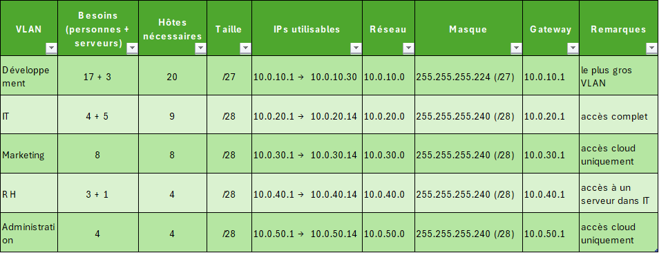

Ci-dessous mon tableau de plan d'adressage IP.  
J'ai pris en compte les éléments du TP (besoins personnes + serveurs).  
J'ia fait en sorte de chosir un masque petit qui évite d'avoir beaucoup d'IP pour rien.  
Néanmoins j'ai un pris un masque qui permet de garder une certaines évolutivité en cas d'arrvée d'un nouvel équipement ou personne.  

